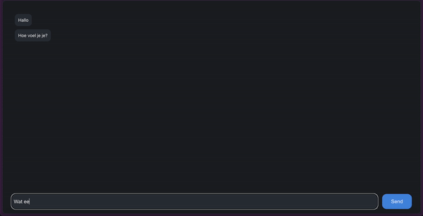
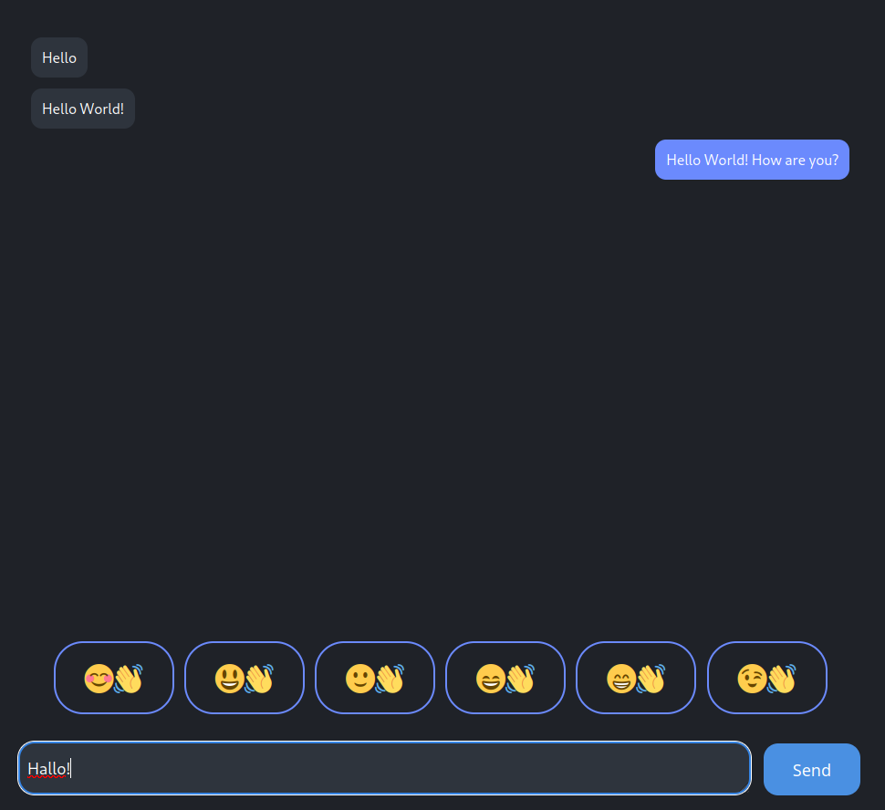

# Eric body language in chat

- [Eric body language in chat](#eric-body-language-in-chat)
	- [Vooronderzoek](#vooronderzoek)
	- [Exclusive Design Principles](#exclusive-design-principles)
		- [Study situation](#study-situation)
		- [Ignore conventions](#ignore-conventions)
		- [Prioritise identity](#prioritise-identity)
		- [Add nonsense](#add-nonsense)
	- [Ideeën](#ideeën)
		- [Emoji zoeker](#emoji-zoeker)
		- [Emoji suggesties](#emoji-suggesties)
		- [Emoji's genereren door beeldherkenning](#emojis-genereren-door-beeldherkenning)
		- [Emoji's suggereren op basis van AI beeldherkenning en emotie analyse](#emojis-suggereren-op-basis-van-ai-beeldherkenning-en-emotie-analyse)
	- [User Scenario](#user-scenario)
		- [Wie is Eric](#wie-is-eric)
		- [Wat wil Eric op onze website](#wat-wil-eric-op-onze-website)
		- [Hoe gaat Eric dit bereiken](#hoe-gaat-eric-dit-bereiken)
		- [Waarom komt Eric naar onze website](#waarom-komt-eric-naar-onze-website)
	- [Eerste prototype](#eerste-prototype)
	- [Test #1 met Eric](#test-1-met-eric)
		- [Achtergrond](#achtergrond)
		- [Testen](#testen)
		- [Conclusie test 1](#conclusie-test-1)
	- [Test #2 met/zonder Eric](#test-2-metzonder-eric)
		- [Aannames voor de test](#aannames-voor-de-test)
		- [Test #2 met Eric](#test-2-met-eric)
		- [Conclusie test 2](#conclusie-test-2)
	- [Derde iteratie](#derde-iteratie)
	- [Conclusie](#conclusie)
		- [Leerdoelen](#leerdoelen)
			- [Leren hoe je (design) principles kan toepassen in een ontwerp](#leren-hoe-je-design-principles-kan-toepassen-in-een-ontwerp)
			- [Users needs begrijpen en gebruiken in je ontwerp](#users-needs-begrijpen-en-gebruiken-in-je-ontwerp)
			- [Leren hoe je moet testen en de resultaten gebruiken voor het verbeteren van je ontwerp](#leren-hoe-je-moet-testen-en-de-resultaten-gebruiken-voor-het-verbeteren-van-je-ontwerp)

**Onderzoeksvraag**: Hoe kan je op een krachtigere manier dan emoji's body language tonen in chat apps?

## Vooronderzoek

Belangrijk om te begrijpen voordat we verder gaan is hoe we lichaamstaal definieren.
Onder lichaamstaal vallen onder andere dingen zoals: gezichtsexpressie, beweging, postuur en houding van het lichaam.
Er zijn meer dingen die vallen onder dit begrip, maar het is belangrijk voor iedereen om het juiste idee te hebben wanneer we het hebben over lichaamstaal voordat we verdergaan.

Ik heb onderzoeken gelezen over kinesics (lichaamstaal) op het internet.
Er zijn hier namelijk verschillende onderzoeken over geweest.
Zonder hier veel op in te gaan tonen deze onderzoeken voornamelijk aan dat het versturen van lichaamstaal over het internet vrij lastig is.
Er zijn geen echte manieren om non-verbale uitingen zoals lichaamshouding, postuur en houding over te brengen zonder elkaar in persoon te zien.
Zelfs video-communicatie doet hier te weinig voor, omdat het zien van een persoon op een scherm anders aanvoelt dan een echt persoon.

Mijn korte onderzoek laat mij dus denken dat de opdracht zoals direct geinterpreteerd niet mogelijk is om uit te voeren.
Daarom zal moeten worden gekeken naar alternatieven die ook voldoen als antwoord.
Gelukkig bestaan er al methoden om ten minste emotie door te brengen over het internet, voornamelijk met behulp van emoticons.
Andere technieken zijn bijvoorbeeld: stickers, foto's en gifs.

## Exclusive Design Principles

De Exclusive Design Principles hebben ons geholpen als richtlijnen om te bepalen waar we op moesten focussen.
Onze app is zeker beter geworden door deze principes in gedachten te houden terwijl we de app ontwikkelden.

### Study situation

Tijdens de tests hebben wij gekeken naar hoe Eric omgaat met zijn apparatuur, zoals zijn telefoon of met onze laptops.
Ook hebben wij gekeken naar de dingen om hem heen, voornamelijk zijn elektrische rolstoel.
Aan de hand van deze observaties kan worden gezien dat Eric ondanks zijn beperking wel snel kan omgaan met bijvoorbeeld een telefoon, maar dat slechts bepaalde acties lastig zijn.

In onze prototypes hebben wij hier rekening mee gehouden door niet te vereisen dat hij bijvoorbeeld zijn camera moet gebruiken, iets dat lastig is voor hem.
Daarnaast is de interface makkelijk te gebruiken en zo gemaakt dat zijn hand de interface niet blokkeert als hij ermee probeert te werken.

### Ignore conventions

Wij hebben bij het maken van onze prototypes wel gekeken naar wat wij anders konden doen dan het normale design.
Het voornaamste verschil is dat er geen traditioneel emojiselectiescherm aanwezig is.
Dat is omdat Eric aan heeft gegeven dat hij moeite heeft met het vinden van emoji's in zo'n scherm.

### Prioritise identity

Tijdens de test hebben wij veel feedback gekregen van Eric wat hij hebben verwerkt in onze prototypes.
Wij hebben geprobeert om Eric te betrekken in het proces door veel aan hem te vragen.
Tot onze spijt heeft Eric niet altijd de tijd en houdt hij zijn rollen als docent en testpersoon goed gescheiden, dus konden we niet de hele tijd feedback vragen voor elke verandering.

### Add nonsense

Onze prototypes hebben een nieuwe technologie toegepast om het aantrekkelijk te maken voor Eric, namelijk AI.
Wij gebruiken GPT-3.5 om de aanbevelingen te doen.
Hoe de AI de suggesties doet van emoji's is altijd gerelateerd aan de tekst, maar heeft wel altijd wel een element van willekeur, wat het leuk maakt om te gebruiken.

Tijdens het ontwikkelen hebben wij zelf al gemerkt dat het erg leuk is om gewoon te spelen met de app en tijdens de test gaf Eric ook hetzelfde aan.
Wij zijn erg tevreden met dit resultaat en het is duidelijk dat Eric het erg leuk vindt om te gebruiken.

## Ideeën

Ik heb in een groep met twee anderen gewerkt aan deze opdracht, namelijk Melvin en Jesse.
Samen hebben wij voorafgaand aan het eerste testmoment een paar ideeën bedacht die we konden uitwerken zodat we iets konden testen op het eerste testmoment.

1. Een snelle en efficiente manier om emoji's te zoeken/vinden in een emoticonselectiescherm.
2. Automatische suggesties van emoji's tijdens het typen.
3. Emoji's genereren met AI beeldherkenning en afbeelding generatie.
4. Emoji's suggereren op basis van AI beeldherkenning en emotie analyse.

### Emoji zoeker

Dit idee stamt uit een onderzoek dat ik had gelezen dat deelnemers vroeg om bepaalde emoji's te vinden in een standaard emojiselectiescherm, waaruit bleek dat er veel te veel emoji's zijn om snel te vinden wat je zoekt.
Het onderzoek benoemde ook een paar alternatieve methoden waarmee emoji's konden worden gecategoriseerd.

Hieruit hadden wij bedacht dat het eventueel mogelijk kon zijn om op basis van kleur emoji's te groeperen.
Zo zou je op een blauwe knop kunnen drukken en alle emoji's die voornamelijk blauw zijn werden dan beschikbaar.

Een andere manier kan zijn om emoji's te groeperen door middel van emotie, maar dit is veel te subjectief en werkt niet in elke situatie.
Sommige emoji's hebben namelijk andere betekenissen op basis van de context.

### Emoji suggesties

Dit idee stamt uit hetzelfde onderzoek als hierboven benoemt, waaruit bleek dat mensen soms moeite hebben met het vinden van de juiste emoji.
Wij bedachten een manier waarmee tekst kon worden geanalyseerd en emoji's konden worden gesuggereerd op basis van deze tekst.

Dit is uiteindelijk ook het gekozen idee geworden.

### Emoji's genereren door beeldherkenning

Met recente ontwikkelingen op het gebied van AI is het mogelijk om afbeeldingen te genereren met een tekst prompt en zelfs met een andere afbeelding.
Wij bedachten een manier waarmee emoji's door middel van AI konden worden gegenereerd speciaal voor de situatie waar Eric zich op dat moment in bevindt.

### Emoji's suggereren op basis van AI beeldherkenning en emotie analyse

Eric zou een foto kunnen nemen van zichzelf wanneer hij via chat emotie wilt doorgeven.
Deze foto zou vervolgens worden geanalyseerd door AI en emoji's kunnen dan worden gesuggereert.
Dit is anders dan het idee hierboven in dat het geen afbeelding generatie bevat, enkel suggesties van al bestaande emoji's.

## User Scenario

### Wie is Eric

Door de handicap van Eric heeft hij moeite met het gebruiken van zijn armen, wat veel impact heeft op hoe hij techniek gebruikt.
In chat applicaties heeft Eric vaak moeite om emoties te uiten.
Zijn vraag is dus of wij een systeem kunnen ontwerpen waarmee hij dit makkelijk kan versturen naar de persoon waarmee hij chat.

### Wat wil Eric op onze website

Zoals besproken hierboven is het probleem dat hij heeft dat hij moeite heeft met het uiten van emoties via chat applicaties.
Wat er dus van onze applicatie gevraagd wordt is dat hij emoties kan versturen via de chat.
Door hoe hij een telefoon of laptop gebruikt is het ook belangrijk om na te denken over hoe de applicatie eruit komt te zien en of het voor hem gebruiksvriendelijk is om te gebruiken.

### Hoe gaat Eric dit bereiken

Eric heeft aangegeven dat hij het lastig vindt om emoji's te gebruiken.
Dit zegt hij omdat hij het moeilijk vindt om een traditioneel emojiselectiescherm te gebruiken en tevens omdat hij begrijpt dat in andere culturen emoji's soms andere betekenissen hebben.
Eric wil vooral een makkelijke en snelle manier van het versturen van emotie via chat.
Het moet niet al te veel tijd kosten en moet niet te moeilijk zijn, maar wel expressief zodat hij veel verschillende soorten emoties kan versturen.

### Waarom komt Eric naar onze website

Op onze website is een prototype van een chatapplicatie waar tijdens het typen van tekst suggesties worden gedaan voor emoji's die passen bij te tekst die is getypt.
Dit is een oplossing voor het probleem omdat dit het proces versimpelt waarmee emoji's kunnen worden geselecteerd.

## Eerste prototype

Wij hebben uiteindelijk gekozen om voor de emoji suggesties door middel van tekst te gaan.
Dit idee hebben wij uitgewerkt in een prototype dat we hebben voorgelegd aan Eric, die dit vrij gemakkelijk leek te kunnen gebruiken.

Hieronder is een schermafbeelding te zien van dit prototype.
Wanneer de gebruiker typt in de tekstbalk onderaan het scherm wordt deze tekst doorgestuurd naar een zelf-geschreven API die met behulp van de GPT-3.5 API emoji's suggereert voor deze tekst.
Dit prototype is volledig werkend en op dit moment te vinden op [eric.ikbenmel.vin](https://eric.ikbenmel.vin).

De werking van dit prototype op een normale gebruiker is niet super goed totdat de gebruiker doorheeft wat er gebeurt.
Wij hebben dit naast Eric ook op medestudenten getest, die de neiging hadden om direct het bericht te versturen zonder te wachten op de emoji suggesties.
Dit kan komen omdat wij niet vertelde wat het punt was van de app, maar waarschijnlijk speelt de laadtijd ook een grote rol.

Uiteindelijk is de belangrijke test natuurlijk met Eric.

## Test #1 met Eric

Op 20 April was onze eerste test waarbij we met Eric konden zitten om ons prototype te testen.

De test is een gezamelijke test met alle anderen die ook voor Eric deze opdracht gaan maken.
De anderen testen dus op hetzelfde moment en wij konden meekijken met hun tests om ook daarvan te leren hoe Eric omgaat met 

Het is ook belangrijk om te zeggen dat dit prototype in ongeveer twee uurtjes in elkaar is gezet en wij nog niet eerder een test hadden gedaan met Eric.
Naast een testsessie was dit ook een belangrijk moment om verder te vragen over Eric's probleem.
Eerst zal ik ingaan op de dingen die wij hebben ondervonden over de opdracht en daarna zal ik verdergaan over de dingen die wij hebben gemerkt tijdens het testen.

### Achtergrond

Eric heeft een aandoening waarbij zijn pezen en spieren tijdens niet goed zijn gegroeit.
Dit zorgde ervoor dat zijn ledenmaten anders zijn gegroeit en ontwikkeld dan normaal.
Hij heeft heel weinig controle over zijn vingers en zijn handen zijn ook ingegroeit.

Na het vragen hoe hij zijn telefoon gebruikt en een demonstratie te hebben gekregen konden wij een aantal dingen zien.

Wij wilden voornamelijk weten welk deel van het scherm hij het makkelijkst kan bereiken en welk gebied moeilijk te bereiken is.
Het blijkt dus dat het voor hem helemaal geen probleem is om het hele scherm te bereiken, maar er zijn wel posities waarin zijn hand het scherm bedekt en het scherm voor hem niet meer zichtbaar is.
Typen gaat vrij snel en lijkt geen probleem te zijn, hoewel het corrigeren wel een taak is.

Wij hebben ook gezien hoe hij een selfie maakt.
Dit is een hele klus, omdat hij niet gemakkelijk zijn telefoon kan oppakken en als dat eenmaal is gelukt kan hij niet op het scherm drukken terwijl hij de camera naar hemzelf richt.
Hiervoor gebruikt hij de timer-functie in de camera-app zodat hij op de knop kan drukken en daarna de camera kan richten zoals hij wil.
Dit is een heel gedoe en kost een hoop tijd.
Wij hebben daarom gekozen om de ideeën die een camera vereisen te laten vallen.

Tijdens het gesprek kwamen wij ook meer te weten over de opdracht zelf.
Het schijnt voor hem een frustratiepunt te zijn om emoji's te selecteren, want er zijn er zo veel.
Dit is precies wat ik ook in het vooronderzoek had gelezen.
Hij heeft dus moeite met het vinden van emoji's in het standaard emojiselectiescherm.
Ons prototype waarmee we een emoji suggestie functie hebben gemaakt kwam dus goed aan.

Wij hebben ook [een video opgenomen](https://cdn.nicecock.eu/hcd/hcd/Attachments/initiele-test-stuur-bericht.mp4) van de initiële test met Eric.
Hierin is te zien hoe Eric een bericht verstuurd via Whatsapp.

### Testen

Deze test is ook [op video](https://cdn.nicecock.eu/hcd/hcd/Attachments/test-not-working-ai.mp4) te bekijken. 

Voor de test hebben wij ons product laten zien aan Eric en hij heeft het kunnen uitproberen.
Tijdens het typen van de tekst werden er emoji's gesuggereerd die passen bij de tekst.
Het een van de dingen lastig was was om de gebruiker te laten weten hoe het werkt op de eerste keer dat hij het gebruikt.
Een soort tutorial is wel nodig.

Ook is er het probleem dat Eric slecht werkt met zijn handen, dus het is vervelend om een muis te gebruiken.
Een touchscreen gaat wel goed, maar voor een laptop is het gebruik van een muis wel vervelend.
Dit is een verbeterpunt.

### Conclusie test 1

Na test één hebben wij een aantal dingen gemerkt dat wij moesten aanpassen aan de app, maar over het algemeen is de functionaliteit van de app erg spot-on.
Wij hadden zoals eerder benoemd geobserveerd dat Eric moeite heeft met gebruiken van de muis, daarom hebben wij functionaliteit toegevoegd om het toetsenbord te gebruiken om de emoji's te selecteren en te versturen.
Ook hebben wij bedacht dat een tutorial nodig was om de gebruiker uit te leggen hoe de app werkt.

## Test #2 met/zonder Eric

Op de tweede testdag was Eric ziek en deze is daarom verplaatst naar de woensdag na de meivakantie op tien mei.
Om deze reden hebben wij een test tussendoor gedaan met een klasgenoot om ons product te testen.
Dit is niet een representatieve test, maar wel een beetje een test voordat de echte test begint.

Aan de hand van de eerste test hebben wij een paar pijnpunten gevonden die verbetert konden worden.
Een van deze verbeteringen was het toevoegen van toetsenbord snelkoppelingen.
Hiermee is het makkelijker om emoji's te selecteren als de gebruiker geen muis wil/kan gebruiken.
Deze test is uitgevoerd op een klasgenoot en is [hier](https://cdn.nicecock.eu/hcd/hcd/Attachments/kb-shortcut-test-ting.mp4) te zien.

In de video is te zien dat er een soort tutorial getoond wordt op het moment dat de emoji's gesuggereerd worden.
Echter, deze klasgenoot was veel te snel en heeft de volledige tutorial gemist...
Dit was niet de bedoeling natuurlijk.

Hiervoor was het beter om de gebruiker te forceren om de tutorial te volgen, wat de volgende versie is geworden.
Wij hebben voor deze versie van het product een tweede versie gemaakt waarin we de controls van de emoji picker hebben gedisabled, waarvan een demonstratie [hier](https://cdn.nicecock.eu/hcd/hcd/Attachments/kb-shortcuts-disable-ui.mov) te zien is.
Het doel van deze versie is om de *mental load* van de gebruiker te verlagen.
Er wordt een backdrop toegevoegd om hiermee te helpen en de controls worden gedisabled.
<!-- TODO: VOEG DE VIDEO VAN DEZE TEST TOE -->

### Aannames voor de test

Voor de test met Eric verwachten we dat hij ongeveer hetzelfde reageert op de tutorial als onze testpersonen, namelijk dat dit niet gezien gaat worden.
Toch gaan we dit testen om te zien of het wel of niet zal werken, om onze aannames te testen.

### Test #2 met Eric

Tijdens de test zijn er meerdere producten van verschillende groepen getest met Eric.
Onze test is het belangrijkste voor dit verslag, maar er zijn wel dingen die benoemd kunnen worden van andere groepen.

* Zorg ervoor dat in de chat applicatie het toetsenbord niet verdwijnt wanneer Eric het bericht verzend.
*	De pijltjestoetsen zijn het handigst voor Eric, want dat werkt beter voor hem.
* Eric zou het fijn vinden als hij de emotie kan veranderen na het versturen.
* De muis is minder handig dan de trackpad.

Toen de test begon werd het al vrij snel duidelijk dat de tutorial niet intuitief werkt.
Eric had een bericht getypt en probeerde deze te versturen, maar dit lukte niet omdat de enter-toets gedeactiveerd was om hem te forceren de tutorial te volgen.
Ook was de bediening van het toetsenbord niet direct duidelijk.
Als laatste was de bediening met het toetsenbord niet erg handig en daarom gebruikte hij toch veel de trackpad.
Uiteindelijk bleek dat hij toch weinig moeite had met het gebruik van de trackpad.

Een belangrijk feedbackpunt was dat Eric vond dat het niet altijd nodig was om twee emoji's te versturen, maar dat soms één voldoende is.
Dit is zeker een goede suggestie voor de volgende versie.

Ook vond Eric het niet altijd nodig om überhaubt emoji's te versturen.
Dit hadden wij ook wel verwacht, daarom is het slechts een optie om de emoji's toe te voegen.
Als de emoji's nog aan het laden zijn is het (als de tutorial afgerond is) gewoon mogelijk om direct het bericht te versturen.

Eric gaf wel aan dat het leuk en plezierig is om met de app te spelen.
Dit is erg positief om te horen en daar zijn wij erg blij mee.

Een andere suggestie was om een aan/uit-knopje toe te voegen waarmee de emoji suggesties aan of uitgezet kunnen worden.

Van deze test is er ook een video [die hier te zien is](https://www.youtube.com/watch?v=Xwmjzj9Me2I).

### Conclusie test 2

Over het algemeen was de tweede test al een succes en waren er weinig dingen die nog aangepast moesten worden.
Dit is vooral te concluderen uit het feit dat Eric het prettig vond om de applicatie te gebruiken.
Dit betekend dat wij voor de volgende iteratie een grote kans hebben dat Eric deze versie volledig accepteert.

## Derde iteratie

Voor de derde iteratie heeft ieder lid van de groep zijn eigen iteratie gemaakt.

De reactie op het product tijdens de tweede test was over het algemeen erg positief, maar er waren een paar kleine dingetjes die verbeterd konden worden.
Daaruit heb ik gehaald dat het beter zou zijn als Eric ook de mogelijkheid krijgt om zelf te kiezen of hij één of twee emoji's verstuurd.
Mijn versie van het laatste product zorgt voor die functionaliteit.

In de nieuwe versie wordt per suggestieknop slechts één emoji getoond, maar nadat Eric een emoji heeft geselecteerd worden de suggestieknoppen veranderd naar de tweede emoji van het paar.
Zo kunnen de suggesties worden gepersonaliseerd, maar hoop ik wel dat er niet te veel mental load is.

In deze versie is ook de tutorial voor de toetsenbordcontrole verwijderd, want het bleek onhandig in gebruik.

Van deze iteratie is ook een test gedaan [die hier te zien is](https://youtube.com/shorts/IZRY7AdJLQE).

## Conclusie 

Uiteindelijk is er geen derde officiele test, dus de derde iteratie is onze laatste versie van het product.
Ik heb tijdens het werken aan deze opdracht veel geleerd over het proces van testen en over het principe van Exclusive Design.
Ik kom niet van een CMD-achtige opleiding, dus het ontwerpen en maken voor eindgebruikers is niet iets waar ik veel ervaring mee heb, dus dit was een leerzame ervaring.

Tijdens het testen is het belangrijk dat je zo weinig mogelijk uitlegt over je app, want het is belangrijk dat het intuitief is voor de gebruiker om te gebruiken.
Als je moet uitleggen hoe functionaliteit werkt dan is het natuurlijk niet intuitief geweest.
Ook moet je als tester veel opschrijven en zelf vragen stellen over de gebruiker en wat de gebruiker wil.
Dit is belangrijk voor de 'Study Situation' en 'Prioritise Identity' Exclusive Design Principles.
Observatie is belangrijk en onder andere het uitleggen van de werking van de app is een verstoring van hoe de gebruiker normaalgesproken zou werken met de app.

### Leerdoelen

De leerdoelen van het vak waren:

* Leren hoe je (design) principles kan toepassen in een ontwerp
* User needs begrijpen en gebruiken in je ontwerp
* Leren hoe je moet testen en de resultaten gebruiken voor het verbeteren van je ontwerp

#### Leren hoe je (design) principles kan toepassen in een ontwerp

Dit leerdoel is behaald omdat ik heb geleerd hoe ik de design principles moet toepassen in een ontwerp voor een applicatie.
Zoals verteld in [Exclusive Design Principles](#exclusive-design-principles) heb ik deze principles in de app toegepast.

#### Users needs begrijpen en gebruiken in je ontwerp

Eric's needs waren in eerste instantie lastig om te begrijpen, maar zeker na de eerste test hebben we zijn probleem ons eigen gemaakt.
Ik heb geleerd hoe ik precies voor één specifiek persoon kan ontwerpen door zijn/haar wensen te begrijpen.
Ook heb ik geleerd hoe ik tijdens tests en interviews de needs van de gebruiker verder kan uitwerken en begrijpen als zij zelf niet precies kunnen verwoorden wat zij bedoelen.
Dit leerdoel is om de bovenstaande redenen behaald.

#### Leren hoe je moet testen en de resultaten gebruiken voor het verbeteren van je ontwerp

Tijdens het testen heb ik veel notities gemaakt en gekeken naar hoe precies de gebruiker omgaat met de applicatie.
Ik heb geleerd dat je goed moet opletten en ook waar je op moet letten tijdens het testen.
Ook heb ik deze resultaten toegepast om het ontwerp te verbeteren.
Ook dit leerdoel heb ik behaald.
